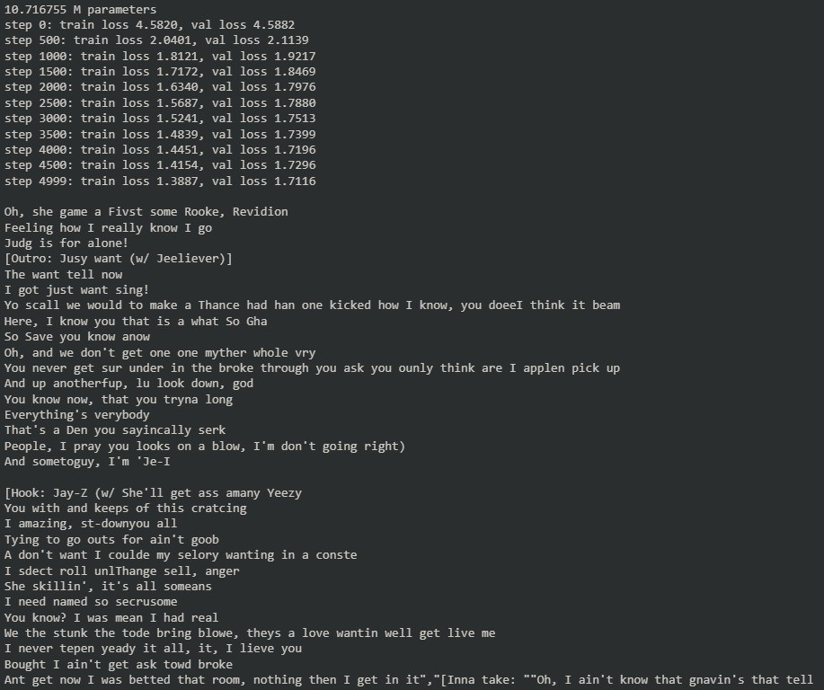

# Tiny-GPT

A Transformer decoder stack with self-attention trained on Kanye lyrics. The raw text data used for training can be found at https://raw.githubusercontent.com/gsurma/text_predictor/master/data/kanye/input.txt.

## Training Details
The model was trained with a 16x32 tensor (batch size x block size) and a 9:1 training to validation set split.

## Note
This model is for research purposes only. Use at your own discretion.

## Demo

